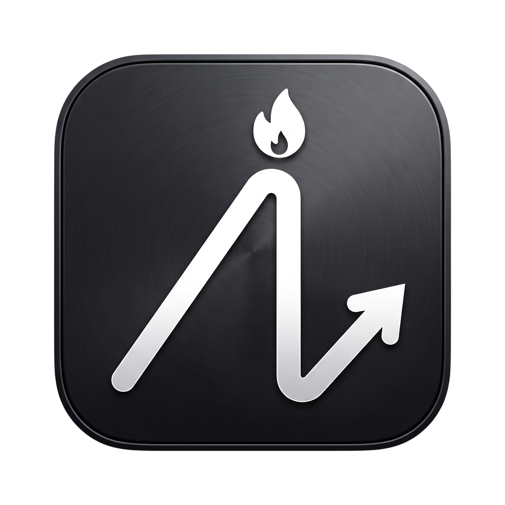

<div align="center">
  <h1>
    
    Apex Routine
  </h1>
  <p><i>Estruturação realista, constância e foco no que realmente importa.</i></p>
</div>

---

### Uma Dedicatória
> *Este projeto nasceu de um propósito muito pessoal. Ele foi desenvolvido com muito carinho e dedicação pensando em alguém muito especial para mim, com o intuito genuíno de auxiliar na manutenção da constância, na sequência de estudos e no foco diário nos objetivos.* 
> *A ideia é que a jornada seja leve e realista, para que as cobranças não se tornem um peso injusto.*

---

## O Significado de "Apex"
O nome **Apex Routine** não foi escolhido por acaso. "Apex" significa o ápice, o ponto mais alto. Ele representa o nosso objetivo final: chegar ao topo da nossa própria constância, sempre em busca de manter a disciplina diária (a maior *streak* possível), seja nos estudos, no treino ou no desenvolvimento pessoal.

A filosofia central do Apex Routine é o **foco absoluto**. Acreditamos que eleger uma única tarefa principal como prioridade no dia nos fornece uma meta cristalina e bem definida. É essa clareza que verdadeiramente auxilia na manutenção da constância a longo prazo, evitando a paralisia por análise e o sentimento de frustração. Ter um foco principal ajuda a estruturar a rotina de maneira realizável.

## Visão Geral e Arquitetura
Do ponto de vista técnico e de produto, o objetivo deste projeto é fornecer as ferramentas para a estruturação de uma rotina de crescimento realista. A arquitetura foi pensada para entregar uma aplicação performática, escalável e de fácil manutenção, respeitando princípios de *Clean Code* e componentização isolada.

### Decisões Arquiteturais e Tecnológicas
O ecossistema do projeto foi escolhido criteriosamente para garantir a melhor experiência de desenvolvimento e o melhor produto final:

- **Linguagem (TypeScript)**: A adoção estrita de tipagem estática previne *runtime errors* e atua como uma documentação viva do código. Interfaces robustas para os modelos de dados (Tasks, Habits, Profile) garantem contratos rígidos entre a camada visual e a lógica de negócios.
- **Framework (React Native & Expo)**: Escolhidos por permitirem um desenvolvimento cross-platform (iOS e Android) com uma única base de código, sem abrir mão do desempenho nativo. O uso do Expo (Managed Workflow) facilita o empacotamento, simplifica atualizações *Over-The-Air* (OTA) e a gestão de pacotes nativos.
- **Roteamento (Expo Router)**: Utilizando o sistema de arquivos para mapear rotas, similar ao Next.js. Proporciona suporte imediato a *Deep Linking* nativo, roteamento estático tipado e separação óbvia entre contextos de telas (`app/(tabs)`).
- **Gerenciamento de Estado (Context API)**: Em vez de bibliotecas pesadas de estado global, optou-se pela Context API nativa do React (`TaskContext`, `FocusContext`, `ProfileContext`). Isso injeta reatividade apenas onde importa, mantendo a performance e o isolamento das regras de negócio.
- **Persistência de Dados (SQLite)**: A persistência foi implementada utilizando `expo-sqlite`, garantindo operações locais robustas, consultas relacionais otimizadas e funcionamento offline nativo. As estatísticas e *streaks* do usuário nunca dependem da conexão com a internet.
- **Design System e UI Customizada**: Todo o estilo visual é construído internamente utilizando `StyleSheet`, sem depender de pacotes de UI pesados. As paletas de cores (`src/theme/colors.ts`) e o sistema de espaçamento são centralizados, garantindo consistência em toda a interface e facilitando implementações como o *Dark Mode*.

## Funcionalidades e Features Core (Atuais)
Nossa implementação avança com entregas consistentes. Eis as principais funcionalidades já operacionais:

1. **Onboarding Wizard & Check-in de Energia**: Sistema humanizado onde o app conhece o usuário nos "primeiros passos". Diariamente, avaliamos a energia do usuário adaptando o dia (*Modo Dia Mínimo* vs *Modo Ápice*).
2. **The "One Thing" Rule (Tarefa Ápice)**: Destaque visual e mecânico para a principal tarefa do dia. A "Tarefa Ápice" é a prioridade absoluta.
3. **Motor Inteligente de Hábitos**: Sistema nativo de criação de rotinas diárias/semanais integrado ao SQLite. Conta com o exclusivo **Motor de Pausa (Modo Férias)**, permitindo congelar o hábito temporariamente sem perder as estatísticas passadas.
4. **Timer Pomodoro (Modo Foco)**: Tela inteiramente dedicada à execução profunda (Deep Work), incluindo animações fluidas, tracking de tempo e um **Feedback Modal** qualitativo para salvar a percepção da sessão ("Ótimo", "Com distrações", "Muito difícil").
5. **Dashboard e Visões Híbridas**: Navegação rica que exibe uma visão central (`Home`), além de opções de blocos de tempo (`Agenda`) e matrizes temporais (`Calendário` mensal/semanal).
6. **Métricas de Gamificação e Resiliência**: Acúmulo de **Pontos de Energia (XP)** e rastreamento de "Ofensiva Ápice" (*Current/Longest Streak*) para incentivar a manutenção da rotina de longo prazo.

## Estrutura de Diretórios
O projeto segue uma arquitetura modular orientada a domínios:

```text
/
├── app/                  # Roteamento baseado no sistema de arquivos (Expo Router)
│   ├── (tabs)/           # Telas da navegação principal (Bottom Tabs)
│   ├── task/             # Fluxos secundários e painéis de criação
│   ├── _layout.tsx       # Configuração de contexto e provedores (Providers) globais
│   └── index.tsx         # Arquivo de redirecionamento (Onboarding vs Dashboard)
├── src/
│   ├── components/       # Componentes visuais (TaskCard, ProgressRing, Heatmap)
│   ├── contexts/         # Central de regras de negócio (TaskContext, FocusContext)
│   ├── database/         # Repositórios SQLite (db.ts, taskRepository, focusRepository)
│   ├── theme/            # Tokens de design (cores, tipografia, espaçamentos)
│   ├── types/            # Declaração de contratos e interfaces
│   └── utils/            # Funções puras utilitárias (manipulação de tempo e arrays)
├── assets/               # Recursos estáticos otimizados (Fontes, Imagens, Ícones)
├── package.json          # Dependências do ambiente Node
└── app.json              # Configuração global do manifest (ícones, splash, permissões)
```

## Inicialização do Ambiente de Desenvolvimento

### Requisitos Básicos
- **Node.js**: Versão 18.x ou superior.
- **Gerenciador de pacotes**: `npm`, `yarn` ou `pnpm`.
- Aplicativo **Expo Go** no dispositivo físico, ou emuladores configurados (Android Studio / Xcode).

### Procedimento
1. Clone o repositório em sua máquina local:
   ```bash
   git clone https://github.com/kksensen/apex-routine.git
   ```
2. Navegue até a raiz do projeto:
   ```bash
   cd apex-routine
   ```
3. Instale as dependências essenciais:
   ```bash
   npm install
   ```
4. Inicialize o empacotador (Metro Bundler):
   ```bash
   npx expo start -c
   ```
5. Escaneie o QR Code no terminal utilizando o aplicativo Expo Go, ou pressione `a` / `i` no terminal para rodar nos emuladores locais.

---
<div align="center">
  <b>Apex Routine</b><br>
  <i>O ápice do seu foco, construído passo a passo.</i>
</div>
